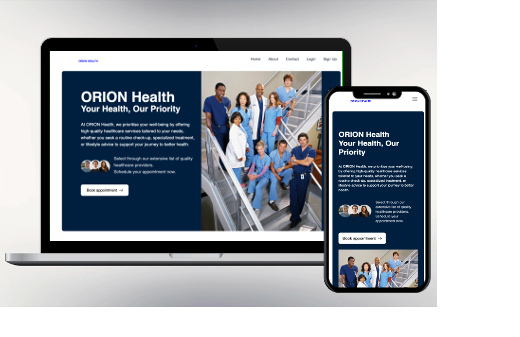

# Orion Health

Orion Health is a healthcare booking application designed to connect patients with healthcare providers. The app allows users to browse doctors by specialty, book appointments, and manage their profiles. It aims to streamline the healthcare experience by providing an intuitive and user-friendly interface.




## Table of Contents

- [Features](#features)
- [Technologies Used](#technologies-used)
- [Installation](#installation)
- [Usage](#usage)
- [Interactive Elements](#interactive-elements)
- [Challenges and Future Enhancements](#challenges-and-future-enhancements)
- [Contributing](#contributing)
- [License](#license)

## Features

- User authentication with login and signup capabilities.
- Specialty carousel displaying different healthcare specialties.
- Responsive navbar for easy navigation.
- Doctor detail modals with ratings and reviews.
- Appointment dates availability for booking.
- Filter functionality to search doctors by specialty.

## Technologies Used

- **React**: For building the user interface.
- **React Router**: For handling routing between different components.
- **Tailwind CSS**: A utility-first CSS framework for styling.
- **Context API**: For managing global state across the application.
- **Axios** (planned): For making HTTP requests in future iterations.
- **Firebase** (planned): For implementing secure authentication.

## Installation

Follow these steps to set up the Orion Health application locally:

1. Clone the Repository

   ```bash
   git clone https://github.com/yourusername/orion-health.git

2.	Navigate to the Project Directory

cd orion-health


3.	Install Dependencies
Use npm or yarn to install the project dependencies.

npm install

or

yarn install


4.	Start the Development Server

npm start

or

yarn start

5.	Open the Application
Navigate to http://localhost:3000 in your web browser to see the application in action.

Usage

	•	Register a new account or log in with existing credentials.
	•	Browse available doctors by specialty and view their profiles.
	•	Book appointments directly through the application.
	•	Manage your profile and appointments in the user dashboard.

Interactive Elements

	•	Specialty Carousel: Displays different specialties in an engaging manner.
	•	Responsive Navbar: Allows easy navigation to different sections of the app.
	•	Account Creation: Users can easily create accounts to manage their healthcare needs.
	•	Doctor Detail Modals: Provides additional information about doctors when clicked, including ratings and patient reviews.
	•	Appointment Dates Availability: Shows users available dates for booking.
	•	Filter Functionality: Users can quickly search for doctors based on specialty.

Challenges and Future Enhancements

Current Challenges:

	•	Data Storage: Using localStorage for user data raises privacy concerns; a more secure database is needed.
	•	Appointment Logic: Currently implemented purely on the frontend; not linked to a backend for real-time data.
	•	Responsiveness: Limited time for adjustments led to some issues with responsive design.
	•	Incomplete Features: Profile and appointment pages are still in skeleton form.

Future Enhancements:

	•	Integrate External APIs: Enable live data for appointment availability.
	•	Notification Reminders: Implement reminders for upcoming appointments to improve user engagement.
	•	Secure Authentication: Use Firebase or a similar service for enhanced data security.
	•	Expand Profile Features: Allow users to upload profile pictures and manage additional personal information.
	•	Implement Database: Shift from localStorage to a secure database for user data management.
	•	Backend Integration: Develop a backend system to handle appointment logic and real-time data.
	•	Improve Responsiveness: Dedicate time to refine the responsive design for various devices.
	•	Complete Feature Development: Focus on fleshing out the profile and appointment pages to enhance user experience.

Contributing

Contributions are welcome! Please feel free to submit a pull request or create an issue for any enhancements or bug fixes.

License

This project is licensed under the MIT License - see the LICENSE file for details.

### Instructions to Customize:
- Replace `https://github.com/yourusername/orion-health.git` with the actual URL of your repository.
- Add any other sections or information that are specific to your project as needed.

Let me know if you need any modifications or further assistance!